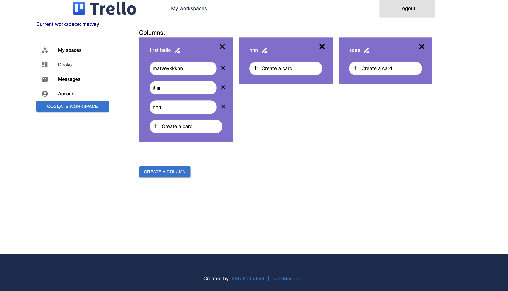

# Trello-clone



## О проекте

**Trello Clone** - веб-приложение, созданное для эффективного управления задачами и проектами. Оно вдохновлено популярным инструментом Trello и предоставляет простой и интуитивно понятный интерфейс для создания, управления и отслеживания задач.

## Возможности

- Создание рабочих пространств.
- Создание нескольких досок для организации проектов.
- Добавление колонок задач на каждую доску.
- Изменение задач в пределах списков.
- Авторизация пользователей.


## Технологии

- *Frontend:* [React](https://github.com/khodosevich/task-manager/tree/main/code/client), Material-UI, Webpack
- *Backend:* [C#](https://github.com/Maketfay/TaskManager/tree/dev)
- *Database:* MySQL
- *Authentication:* JSON Web Tokens (JWT)

## Запуск

1. **Клонировать репозиторий:**

    ```bash
    git clone https://github.com/khodosevich/task-manager
    ```

2. **Установить зависимости:**

    ```bash
    cd code/client
    npm install
    ```

3. **Запустить приложение:**

    ```bash
    npm start
    ```

